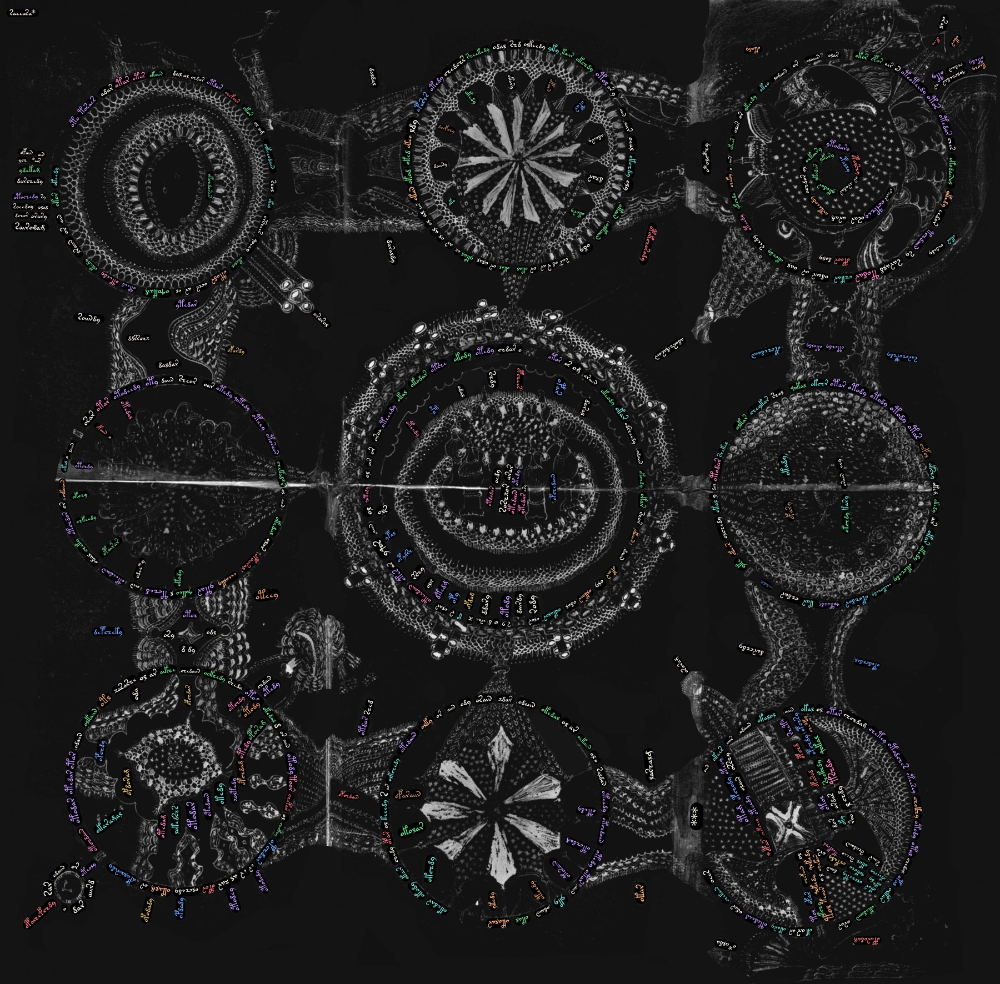

# The Nine Rosettes, retyped

**The first complete positioned and oriented transliteration of the Voynich Manuscript's Nine Rosettes foldout (Beinecke MS 408, f85v–f86r) — open, machine-readable, and independently replicable.**

Every one of the foldout's **539 text tokens** has been hand-traced, hand-placed and hand-oriented on the page: position, rotation, size, region membership — plus a **ductus annotation for every gallows glyph** (family K/T/P/F × stroke grade 1/2/3, read from the feet at the stem base). The text layer is rendered two ways: standard **EVA** and **EVA Placa**, a typeface extension where each gallows is drawn with its ductus-variant glyph, so the stroke grade is typographically visible on the page for the first time.

To our knowledge nothing like this existed for this folio: the closest prior project, [voynichese.com](https://github.com/voynichese/voynichese), maps word boxes on 225 folios but **excludes the Rosettes page by design and stores no orientation** — and the standard IVTFF transliterations encode placement only symbolically. The Rosettes are precisely the page where axis-aligned tooling gives up: the text runs on rings.

## See it, use it, check it

- **Explore live** (read-only, no login): https://voynich-sh.netlify.app/overlay.html?folio=f85v_86r
  Switch layers from the top bar: original page · drawings-only · transcription · ductus grades · EVA glyphs · **EVA Placa** · natural/UV plate.
- **Download everything**: this repository (or the [download page](https://voynich-sh.netlify.app/data.html)) — positions and orientations (JSON + flat CSV), the 46 raw tracing files with per-glyph ductus attributions and word baseline vectors, region shapes and transforms, the live Placa transliteration with its slicing rules, the ductus taxonomy with canonical exemplars, 38 hand calibrations of gallows on the ideal 3×3 lattice, and the EVA Placa font.
- **Replicate independently**: `scripts/rebuild_overlay_defaults.py` regenerates every token's placement from the raw tracings alone (verified: 539/539); `scripts/render_plate.py` re-renders the plate from the dataset only; `scripts/gen_uv_plate.py` documents the UV look for a Beinecke scan you fetch yourself. No proprietary tooling required.

License: **CC BY 4.0** for the spatial data and annotations. Transliteration layer credits Takeshi Takahashi and Zandbergen–Landini (ZL3b); EVA Placa derives from Gabriel Landini's EVA Hand 1. Manuscript images are not redistributed (public-domain scans at the Beinecke Digital Library).

## Part of something larger

This release is one piece of a broader, ongoing programme over the **entire manuscript**, working outward from the folii with circular diagrams: anchoring every symbol to its place on the page — not only to orient it, but to extract it, compare it in batches, and measure the ductus dimension that transcriptions flatten away. The Rosettes come first because they are the page everyone is drawn to, and the page that positional tooling had always skipped. The rest of the corpus follows.

Use it, test your hypotheses against it, prove us wrong. Credit and challenges equally welcome — [open an issue](https://github.com/alessandroplaca-uro/voynich-spatial-data/issues).

> Placa, A. (2026). *Voynich Spatial Data: positioned transliteration and ductus annotations of Beinecke MS 408, including the Nine Rosettes foldout.* https://github.com/alessandroplaca-uro/voynich-spatial-data
